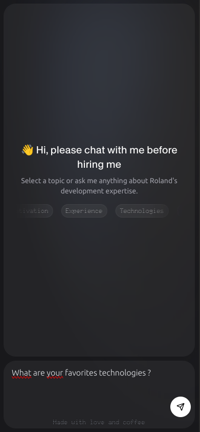
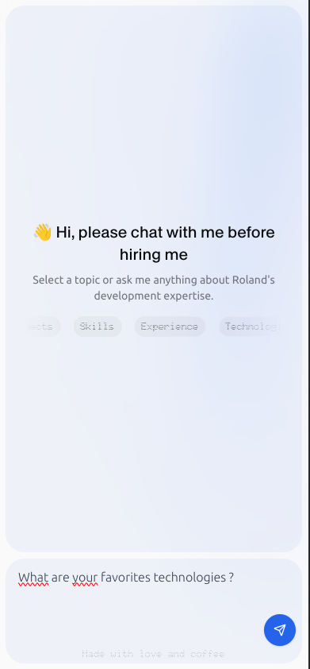
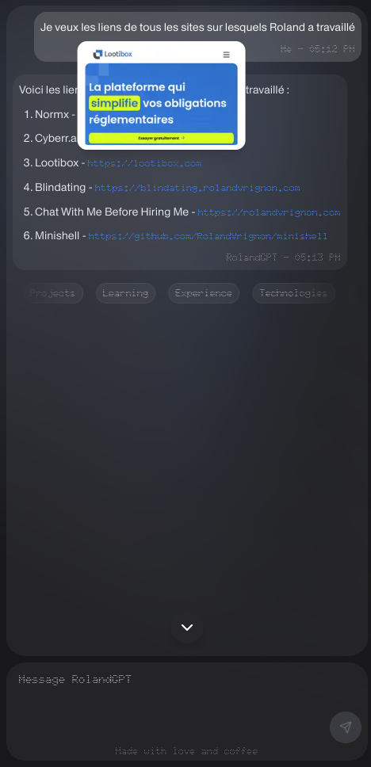

# Chat With Me Before Hiring Me 🤖

**Chat With Me Before Hiring Me** is an interactive chatbot powered by AI, which allows users to upload their resumes in different languages for a more personalized experience. The chatbot can respond not only with text but also with interactive components, such as changing the theme or language of the website, or even displaying the resume. This application is built using the Vercel AI SDK (RSC), enabling the streaming of components for a richer experience than a traditional text-based chatbot.


|  |  |  |
|----------------------------------------|----------------------------------------|----------------------------------------|

## Table of Contents

- [Project Description 📝](#project-description)
- [Features ✨](#features)
- [AI Model 🧠](#ai-model)
- [Prerequisites 📋](#prerequisites)
- [Installation 🚀](#installation)
- [Configuration ⚙️](#configuration)
- [Running the Project 🏃‍♂️](#running-the-project)
- [Personalizing the Resume 📄](#personalizing-the-resume)
- [Adding a Language 🌐](#adding-a-language)
- [Usage Examples 💡](#usage-examples)
- [Contributing 🤝](#contributing)
- [License 📜](#license)

## Project Description 📝

**Chat With Me Before Hiring Me** allows recruiters or users to ask a chatbot questions based on a resume uploaded in a specific folder. You can upload your resume in various languages, enabling the chatbot to provide contextual responses based on the selected language and the content of the resume.

Thanks to the use of Vercel AI SDK and React Server Components (RSC), the chatbot can do much more than provide textual answers. It can interact with specific components, such as the **ThemeSwitcher**, **LanguageSwitcher**, and **resume visualization**. This approach allows for a rich and interactive user experience.

## Features ✨

- **Multilingual Support**: Upload and display your resume in multiple languages.
- **AI-Powered Interaction**: The chatbot uses the Vercel AI SDK to provide intelligent responses based on your resume.
- **Component Streaming**: The chatbot can display dynamic components, such as:
    - **Resume visualization**: Display a visual representation of your resume.
    - **Theme switching**: Switch between dark and light themes.
    - **Language switching**: Change the website's language dynamically.

## AI Model 🧠

This project uses the Mistral AI model, specifically `mistral-small-latest`, for generating responses. The model provides efficient and accurate natural language processing capabilities while maintaining good performance.

## Prerequisites 📋

Before you start, you'll need the following installed on your machine:

- **Node.js v20 or higher** (required for Next.js)
- **pnpm** package manager

## Installation 🚀

To install the project dependencies, follow these steps:

1. Clone this repository:
```bash
git clone https://github.com/your-username/chat_with_me_before_hiring_me.git
```

2. Navigate into the project directory:
```bash
cd chat_with_me_before_hiring_me
```

3. Install the dependencies using `pnpm`:
```bash
pnpm install
```

4. Rename the `.env.example` file to `.env`.

5. Add your OpenAI API key, bot name, and user name in the `.env` file:
```bash
MISTRAL_API_KEY= ## Mistral Api Key
NEXT_PUBLIC_ASSISTANT_NAME="JohnGPT"
NEXT_PUBLIC_USER_NAME="John"
```
- Replace `## OpenAI API Key` with your actual OpenAI API key.
- Set `NEXT_PUBLIC_ASSISTANT_NAME` to the desired name of your bot.
- Set `NEXT_PUBLIC_USER_NAME` to your name.

## Configuration ⚙️

To configure the chatbot and customize the responses based on your resume, you'll need to modify the `actions.tsx` file located in `./src/app/actions.tsx`. This file controls the flow of messages and interactions within the chatbot, including the ability to fetch your resume content and display it in the conversation.

The main components used for the configuration are:

- **ThemeSwitcher**: Changes the website's theme.
- **LanguageSwitcher**: Changes the language of the website.
- **Resume Fetching**: The bot fetches and displays the resume content, depending on the language set.

## Running the Project 🏃‍♂️

Once the dependencies are installed, you can start the development server:
```bash
pnpm run dev
```
This will start the project locally at `http://localhost:3000`.

## Personalizing the Resume 📄

To personalize your chatbot responses, simply upload your resume under `./public/resume.pdf`.

The chatbot will automatically fetch and display the content of the resume based on the language selected.

## Adding a Language 🌐

To add a new language to the chatbot, follow these steps:

1. Add a `text.json` file containing the translations for your language in the appropriate language folder under `./src/locales/`. For example, for Italian, you'd add the file in `./src/locales/it/text.json`.

2. Update the `Languages` type in `./src/types/types.ts` to include the new language. For example, to add Italian, modify the **Languages** object as follows:
```Typescript
export const Languages = {
  en: "English",
  nl: "Dutch",
  de: "German",
  es: "Spanish",
  fr: "French",
  it: "Italian"  // Add the new language here
} as const;
```
3. You can now interact with the chatbot in your newly added language.

## Usage Examples 💡

Once the project is running, you can interact with the chatbot by typing questions related to your resume. For example:

- "Tell me about your education?"
- "What is your professional experience?"
- "Switch on French"

The chatbot will provide a contextual response based on the resume content and can display interactive components like the **ThemeSwitcher** or **Resume visualization** when required.

## Contributing 🤝

We welcome contributions to the project! If you would like to contribute, feel free to fork the repository, make your changes, and submit a pull request. Be sure to include tests and documentation for your contributions.

## License 📜

This project is licensed under the MIT License - see the LICENSE file for details.


