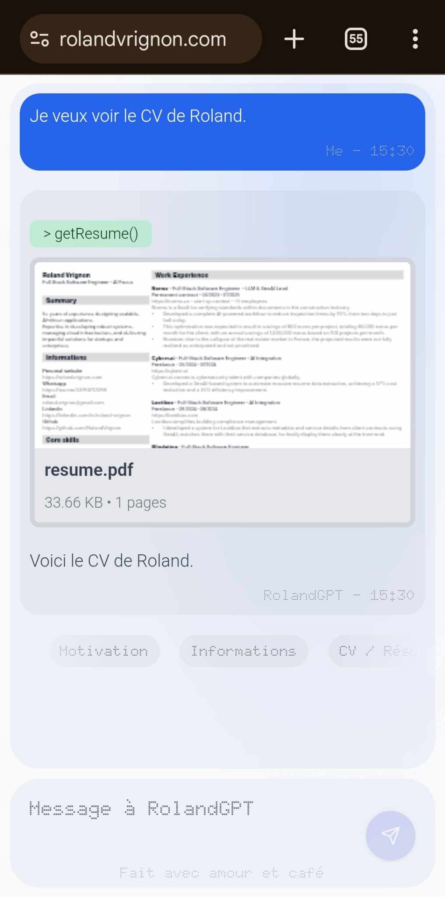
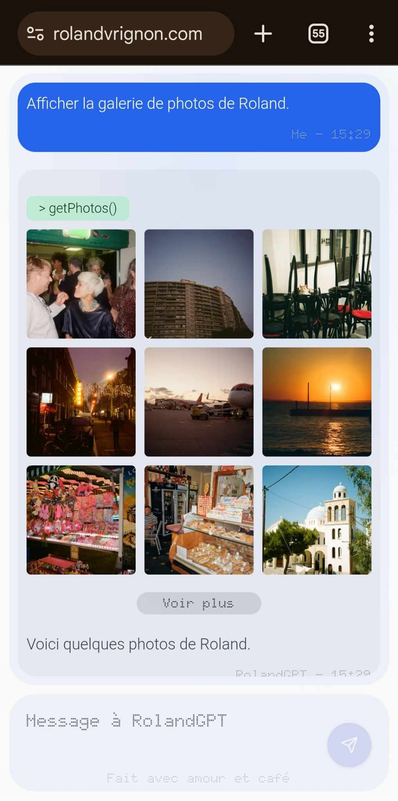
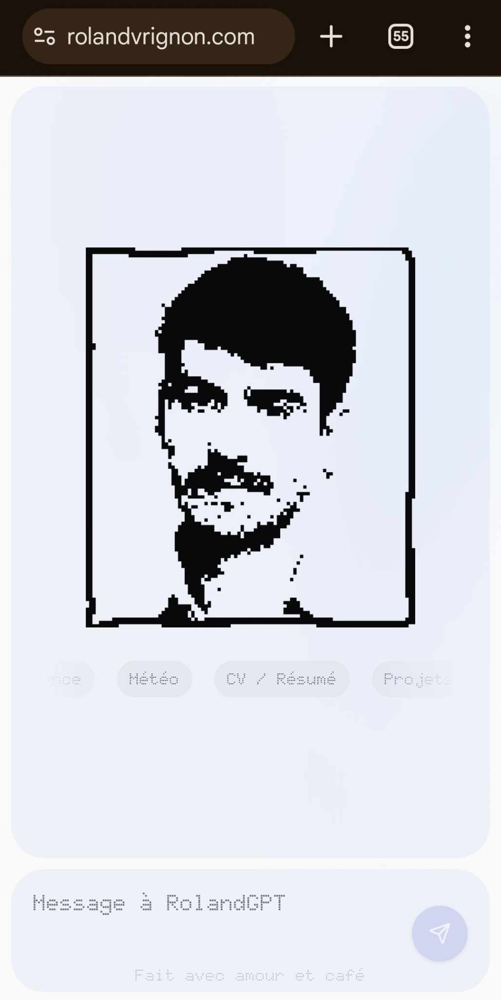
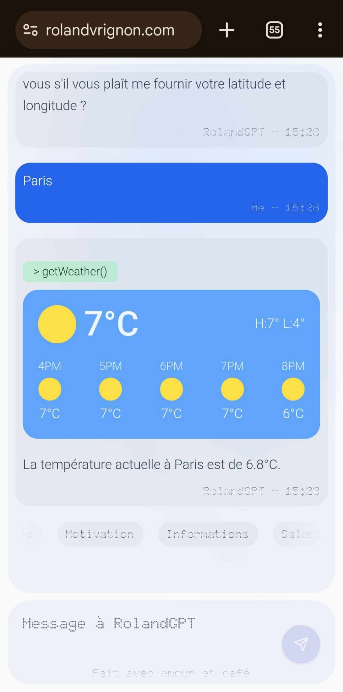

# 🔮 HireMeAI

**HireMeAI** is an **AI-powered chatbot** designed to **help recruiters interact with your resume in an engaging way**. Using **Mistral AI** and **Vercel AI SDK**, this chatbot goes beyond text-based interactions by incorporating **dynamic components** such as resume visualization, contact form, photo gallery and more.

[](https://opensource.org/licenses/MIT)
[](https://github.com/RolandVrignon/HireMeAI/actions)
[](https://github.com/RolandVrignon/HireMeAI/stargazers)

|  |  |  | 
|----------------------------------------|----------------------------------------|----------------------------------------|----------------------------------------|

## Table of Contents

- [Features ✨](#features)
- [Upcoming Features 🚀](#upcoming-features)
- [AI Model 🧠](#ai-model)
- [Prerequisites 📋](#prerequisites)
- [Installation 🚀](#installation)
- [Running the Project 🏃‍♂️](#running-the-project)
- [Personalizing the Resume 📄](#personalizing-the-resume)
- [Adding a Language 🌐](#adding-a-language)
- [Usage Examples 💡](#usage-examples)
- [Contributing 🤝](#contributing)
- [License 📜](#license)

## Features ✨

- **Multilingual Support**: Upload and display your resume in multiple languages.
- **AI-Powered Interaction**: The chatbot uses the Vercel AI SDK to provide intelligent responses based on your resume.
- **Component Streaming**: The chatbot can display dynamic components, such as:
    - **Resume visualization**: Display a visual representation of your resume.
    - **Theme switching**: Switch between dark and light themes.
    - **Language switching**: Change the website's language dynamically.

## 🔮 Upcoming Features

- [ ] **Education Server Component** – Display and discuss educational background
- [ ] **Professional Server Component** – Showcase work experience dynamically
- [ ] **Project Showcase** – Interactive way to present portfolio projects
- [x] **Resume Displayer** – Visual resume integration ✅ (Completed)
- [ ] **Enhanced Context Support** – Add cover letter, portfolio links, and more
- [x] **Weather Component** – Display real-time weather information ✅ (Completed)

These upcoming features will enhance the interactive capabilities of the chatbot, allowing for more dynamic and engaging conversations about different aspects of the resume and additional professional context.

## AI Model 🧠

This project uses the Mistral AI model, specifically `mistral-small-latest`, for generating responses. The model provides efficient and accurate natural language processing capabilities while maintaining good performance.

## Prerequisites 📋

Before you start, you'll need the following installed on your machine:

- **Node.js v20 or higher** (required for Next.js)
- **pnpm** package manager

## Installation 🚀

To install the project dependencies, follow these steps:
```bash
git clone https://github.com/RolandVrignon/HireMeAI.git
```

2. Navigate into the project directory:
```bash
cd HireMeAI
```

3. Install the dependencies using `pnpm`:
```bash
pnpm install
```

4. Rename the `.env.example` file to `.env`.

5. Add your environment variables in the `.env` file:
```bash
# Required - Mistral API key for the chatbot
MISTRAL_API_KEY="your-mistral-api-key"

# Required - Names displayed in the chat interface
NEXT_PUBLIC_ASSISTANT_NAME="JohnGPT"
NEXT_PUBLIC_USER_NAME="John"

# Optional - Google Calendar integration
NEXT_PUBLIC_GOOGLE_CALENDAR_ID="your-calendar-embed-url"

# Optional - Email contact form integration
EMAIL_USER="your.email@gmail.com"
EMAIL_APP_PASSWORD="your-gmail-app-password"  # Gmail App Password, not your regular password

#Optional - Whatsapp number integration
NEXT_PUBLIC_WHATSAPP_NUMBER="33010101010"

```

### Setting up Gmail App Password

To use the contact form feature, you need to set up a Gmail App Password:

1. Go to your Google Account settings: https://myaccount.google.com/
2. Enable 2-Step Verification if not already done
3. Go to "Security" → "2-Step Verification" → "App passwords"
4. Select "Other (Custom name)" from the dropdown
5. Name it (e.g., "NextJS Contact Form")
6. Copy the generated 16-character password
7. Paste it as your `EMAIL_APP_PASSWORD` in `.env`

### Setting up Google Calendar Integration

To display your availability calendar:

1. Go to Google Calendar
2. Click the settings gear icon → "Settings"
3. Select your calendar under "Settings for my calendars"
4. Scroll to "Integrate calendar"
5. Copy the "Embed code" URL
6. Paste it as your `NEXT_PUBLIC_GOOGLE_CALENDAR_ID` in `.env`

## Running the Project 🏃‍♂️

Once the dependencies are installed, you can start the development server:
```bash
pnpm run dev
```
This will start the project locally at `http://localhost:3000`.

## Personalizing the Resume 📄

To personalize your chatbot responses, simply upload your resume under `./public/resume.pdf`.

The chatbot will automatically fetch and display the content of the resume based on the language selected.

## Adding a Language 🌐

To add a new language to the chatbot, follow these steps:

1. Add a `text.json` file containing the translations for your language in the appropriate language folder under `./src/locales/`. For example, for Italian, you'd add the file in `./src/locales/it/text.json`.

2. Update the `Languages` type in `./src/types/types.ts` to include the new language. For example, to add Italian, modify the **Languages** object as follows:
```Typescript
export const Languages = {
  en: "English",
  nl: "Dutch",
  de: "German",
  es: "Spanish",
  fr: "French",
  it: "Italian"  // Add the new language here
} as const;
```
3. You can now interact with the chatbot in your newly added language.

## Usage Examples 💡

Once the project is running, you can interact with the chatbot by typing questions related to your resume. For example:

- "Tell me about your education?"
- "What is your professional experience?"

## Contributing 🤝

We welcome and appreciate contributions from the community! Here's how you can contribute:

### Types of Contributions

- 🐛 **Bug Reports**: Create an issue describing the bug and how to reproduce it
- ✨ **Feature Requests**: Suggest new features or improvements
- 📝 **Documentation**: Help improve or translate the documentation
- 💻 **Code Contributions**: Submit pull requests with bug fixes or new features

### How to Contribute

1. **Fork the Repository**
   ```bash
   git clone https://github.com/your-username/chat_with_me_before_hiring_me.git
   ```

2. **Create a Branch**
   ```bash
   git checkout -b feature/your-feature-name
   ```

3. **Make Your Changes**
   - Follow the existing code style
   - Add comments where necessary
   - Update documentation if needed

4. **Test Your Changes**
   - Ensure all existing tests pass
   - Add new tests if needed
   - Test the application locally

5. **Submit a Pull Request**
   - Provide a clear description of the changes
   - Reference any related issues
   - Update the README if needed

### Development Guidelines

- Use TypeScript for all new code
- Follow the existing project structure
- Use meaningful commit messages
- Keep pull requests focused on a single feature or fix
- Add appropriate documentation for new features

### Need Help?

Feel free to create an issue for:
- Questions about the codebase
- Clarification on how to implement a feature
- Discussion about potential improvements

We aim to review all contributions within a week. Thank you for helping improve HireMeAI! 🙏

## License 📜

This project is licensed under the MIT License - see the LICENSE file for details.


